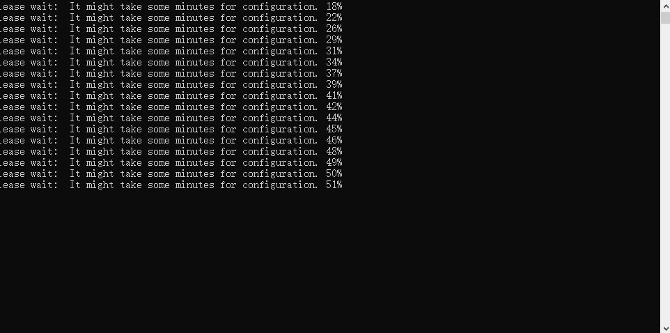

# 基于多特征点的视频拼接
&emsp;&emsp;**本项目是学习完基于sift的图像拼接的基础上完成的，通过利用sift,surf,harris等特征点进行视频的拼接，感觉效果还算可以，另外实时性也勉强能够跟得上，但对于最后的拼接结果，因为对于最后拼接阶段的光照均衡没有做特殊的处理，所以照片过渡上存在一些不自然的变化，可以继续改进进行,下面简单展示程序运行过程。**
######进入程序，载入视频信息

######匹配阶段

######拼接效果

